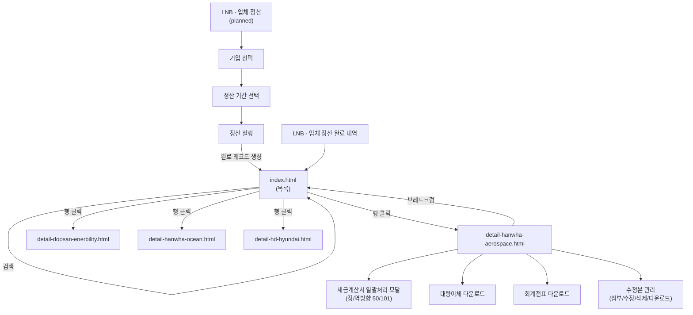

# 03. 네비게이션플로우

## 1. LNB(좌측 메뉴) 전체 구조
```
Olive ticket (홈)
├─ 기업체 관리
├─ 가맹점 관리
├─ 올리브 상품권 관리
├─ 모바일 쿠폰 관리
├─ 식권 관리
├─ SMS 발송내역
├─ 정산 관리  ★ 본 프로젝트 범위
│  ├─ 업체 정산                        ← [planned] src/settlement/
│  ├─ 업체 정산 완료 내역  ◀ 현재 페이지  ← src/index.html
│  ├─ 가맹점 정산 완료 내역
│  ├─ 개인포인트 정산 완료 내역
│  ├─ 수동 정산
│  ├─ 지난정산 엑셀다운로드
│  ├─ 매입 매출 내역
│  └─ 매입 매출 내역(실시간)
├─ 서비스 관리
├─ 회원 관리
├─ 설정 관리
└─ 계좌 이체 관리
```

## 2. 본 프로젝트 화면 이동 다이어그램



## 3. 서브탭 플로우 (업체 정산 완료 내역)
```
[업체 정산 완료 내역]  ◀ 현재
[업체 정산 완료 내역(월별)]
[구내식당 정산 완료 내역]
```

## 4. 상세 페이지 내부 인터랙션 (detail-hanwha-aerospace 기준)

```
상세 페이지
├─ 기업 정보 헤더
├─ 정산 내역 섹션
│   └─ [원본 다운로드] · [수정본 업로드] · [미리보기] · [삭제]
├─ 세금계산서 섹션
│   ├─ [다운로드] → 팝업 (타입/건수 선택)
│   │   ├─ 역방향(reverse)
│   │   ├─ 정방향 50건(forward_50)
│   │   └─ 정방향 101건(forward_101)
│   └─ [미리보기]
├─ 대량이체 섹션
│   └─ [다운로드] (bulk_transfer)
└─ 회계전표 섹션
    └─ [다운로드] (reverse_detail)
```

## 5. 페이지 ↔ 리소스 맵 (프런트 라우팅 관점)

| 화면 | 파일 | 진입 경로 | 의존 리소스 |
|---|---|---|---|
| 목록 | `src/index.html` | 루트 진입점 | - |
| 상세(한화에어로) | `src/pages/detail-hanwha-aerospace.html` | 목록 → 행 클릭 | `../assets/js/bulk-registration.js`, `../assets/data/store_master.json`, `../../resources/templates/*` |
| 상세(두산/한화오션/HD현대) | `src/pages/detail-*.html` | 목록 → 행 클릭 | (와이어프레임) |
| 와이어프레임 | `src/wireframes/wireframe-detail.html` | 별도 열람 | - |
| [planned] 정산하기 | `src/settlement/` | LNB "업체 정산" | TBD |

## 6. 외부/미구현 링크
- 대부분의 LNB 항목은 `href="#this"` — 본 레포 범위 아님.
- 구현된 실제 링크: `src/index.html` ↔ `src/pages/detail-*.html` ↔ `src/index.html` (브레드크럼).
